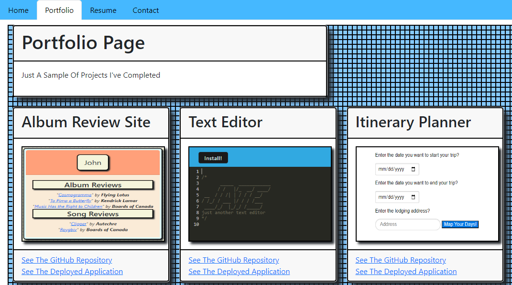

# React Portfolio Project - John Zigterman

## Description

- I set out to create a portfolio in React JS that would showcase my projects and my development skills learned so far.
- I wanted to make a responsive and dynamic portfolio that was impressive in both design and functionality.
- I used a NavBar system to dynamically load seperate pages on one React Outlet to create a smooth experience.
- I took it upon myself to develop this as not just an expression of my skills, but of the type of enthusiasm and style I bring to a project.

## Installation

This is a deployed web page and can be viewed publicly by anyone at the provided link.

## Usage

You may use my portfolio to track my progress as a developer, and stay alert on new projects I've been tinkering with.

## Credits

I, John Paul Zigterman, completed this project by myself with the aid of the resources provided to me by the MSU coding bootcamp.

## Link

https://github.com/JohnPaulZigterman/react-portfolio

## Screenshot

## License

MIT License

Copyright (c) 2023 John Paul Zigterman

Permission is hereby granted, free of charge, to any person obtaining a copy
of this software and associated documentation files (the "Software"), to deal
in the Software without restriction, including without limitation the rights
to use, copy, modify, merge, publish, distribute, sublicense, and/or sell
copies of the Software, and to permit persons to whom the Software is
furnished to do so, subject to the following conditions:

The above copyright notice and this permission notice shall be included in all
copies or substantial portions of the Software.

THE SOFTWARE IS PROVIDED "AS IS", WITHOUT WARRANTY OF ANY KIND, EXPRESS OR
IMPLIED, INCLUDING BUT NOT LIMITED TO THE WARRANTIES OF MERCHANTABILITY,
FITNESS FOR A PARTICULAR PURPOSE AND NONINFRINGEMENT. IN NO EVENT SHALL THE
AUTHORS OR COPYRIGHT HOLDERS BE LIABLE FOR ANY CLAIM, DAMAGES OR OTHER
LIABILITY, WHETHER IN AN ACTION OF CONTRACT, TORT OR OTHERWISE, ARISING FROM,
OUT OF OR IN CONNECTION WITH THE SOFTWARE OR THE USE OR OTHER DEALINGS IN THE
SOFTWARE.